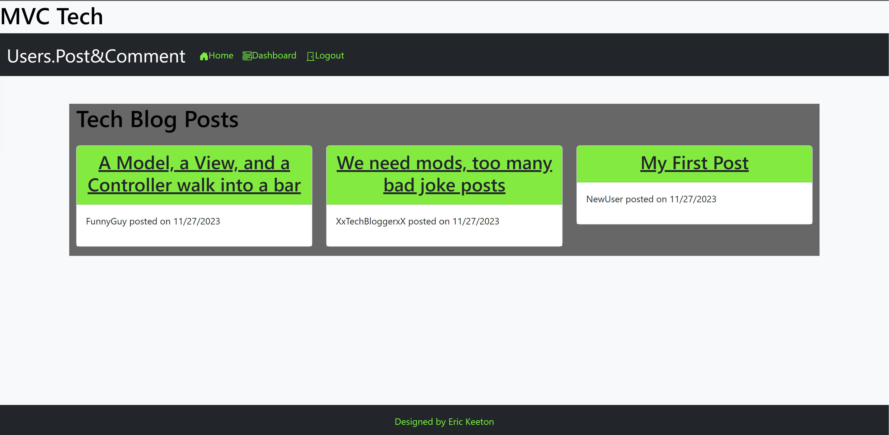

# MVC-Tech-Blog-Site

 
Licensing: [mit](https://choosealicense.com/licenses/mit/)
    
## Table of Contents
  
- [Description](#description)
- [Installation](#installation-requirements)
- [Usage](#application-usage)
- [License](#licensing-information)
- [Contributions](#contributions)
- [Tests](#tests-commands)
- [Video Link](#link-to-video-instructions)
- [Screenshot](#screenshot)
- [Questions](#questions)
  
## Description
a CMS-style blog site similar to a Wordpress site, where developers can publish their blog posts and comment oother developers’ posts as well.
  
## Installation Requirements
bcryptjs@2.4.3 connect-session-sequelize@7.0.4 dotenv@8.6.0 express@4.17.1 express-handlebars@5.2.express-session@1.17.1 handlebars@4.7.6 mysql@2.3.3 sequelize@6.29.3
  
## Application Usage
Utilize the browser to sign up, login, post, and comment on MVC-Tech Blogs!
    
## Contributions
Eric Keeton
  
## Test Commands
npm i npm run start
  
## Link to Video Instructions
https://mvc-tech-blogsite-2946fdd7cbfe.herokuapp.com/
  
## Screenshot

  
## Questions
For Questions, contact me at emk2473@gmail.com or visit My Github: [emk2473](https://github.com/emk2473)
  
  